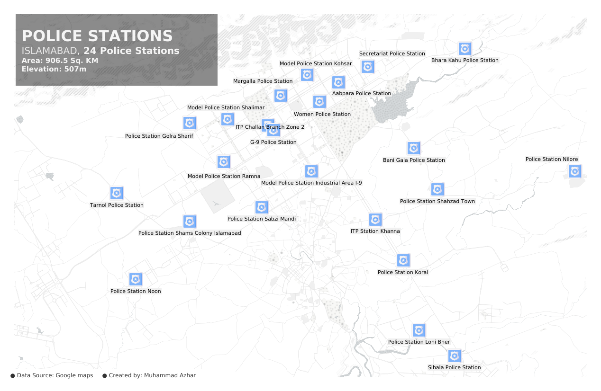

<h1 style="font-weight:normal" align="center">
  &nbsp;Maps of Pakistan&nbsp;
</h1>

&nbsp;&nbsp;&nbsp;

<!-- 

   
  
    

 -->

This repo contains maps of Pakistan created with `{Mapbox Studio}`and `{QGIS}`

| | | |
|:-------------------------:|:-------------------------:|:-------------------------:|
|  Map of Police stations in Islamabad |   Islamabad Elevation|  Hospitals in Islamabad|
|  Hospitals in Islamabad(2)|   Health Facilities in Pakistan|

